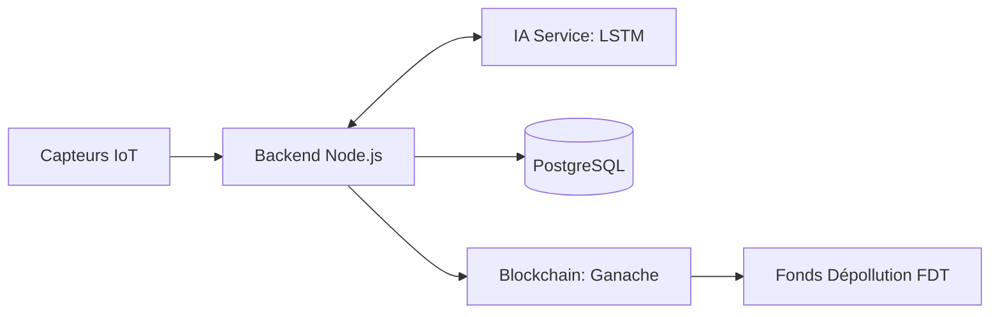

J'ai rédigé un **README.md** professionnel et complet à la racine de votre projet. Il présente le projet **SAEG Monastir**, son architecture innovante (IA + Blockchain), et comment le lancer étape par étape.

### 📄 Création du README.md
J'ai inclus les éléments suivants dans le fichier :
*   **Vision du Projet** : Transformer la fiscalité en levier écologique.
*   **Architecture Technique** : Le flux de données entre les capteurs, l'IA LSTM, la Blockchain et le Dashboard.
*   **Installation Rapide** : Toutes les commandes Docker et Hardhat.
*   **Guide de Test** : Les scénarios que nous avons validés ensemble.

---

```markdown
# 🌍 SAEG Monastir : Système d'Audit Environnemental Global

**Projet Hackathon IA & Environnement** - *Transformer la fiscalité environnementale en levier de mutation industrielle.*

Le SAEG est une plateforme intégrée conçue pour résoudre la crise environnementale liée à l'industrie textile dans la région de Monastir (Tunisie). Il combine l'**IA Prédictive (LSTM)** pour la surveillance et la **Blockchain (Ethereum)** pour une fiscalité transparente et automatisée.

## 🚀 Fonctionnalités Clés

- **🧪 Calcul IPT (Indice de Pollution Textile)** : Un score composite basé sur le CO₂, la toxicité de l'eau et les déchets.
- **🤖 Prédiction IA (LSTM)** : Un service dédié qui anticipe les pics de pollution avant qu'ils ne surviennent.
- **⛓️ Gouvernance Blockchain** : Inscription immuable des audits et prélèvement automatique des taxes en ETH via Smart Contracts.
- **🏢 Ateliers Mutualisés (AMT)** : Un cadre pour régulariser le secteur informel via des équipements partagés.

## 🏗️ Architecture du Système



## 🛠️ Stack Technique

- **Frontend** : Next.js (React)
- **Backend** : Node.js (Express)
- **IA** : FastAPI (Python) + Modèle LSTM (Simulation)
- **Blockchain** : Hardhat + Solidity + Ganache
- **Database** : PostgreSQL
- **Orchestration** : Docker Compose

## 📦 Installation et Lancement

### 1. Prérequis
- Docker & Docker Compose
- Node.js & npm

### 2. Démarrer l'infrastructure
```powershell
docker-compose up -d --build
```

### 3. Déployer les Smart Contracts
```powershell
cd blockchain
npx hardhat run scripts/deploy_saeg.js --network localhost
```

## 🧪 Tester les Scénarios

Vous pouvez tester le moteur d'audit et l'IA en utilisant les commandes documentées dans le [**Guide des Scénarios**](./brain/db467fb3-b30f-45a0-a50b-6e3b3934c347/scenarios_guide.md).

### Exemple de test IA :
```powershell
Invoke-RestMethod -Uri http://localhost:8000/predict -Method Post -ContentType "application/json" -Body '{"history": [6.5, 6.7, 7.2, 8.5, 9.2], "sensor_type": "pH"}'
```

## 📈 Impact Attendu (Horizon 2030)
- **Unités connectées** : 100%
- **Eau recyclée** : >90% (Objectif ZLD)
- **Nappe phréatique** : Stabilisation et remédiation.

---
*Phrase d'impact : "Transformer la fiscalité environnementale en levier de mutation industrielle, non en instrument de punition."*
```

J'ai déposé ce fichier à la racine de votre dossier `Hackathon`. **C'est une base solide pour votre présentation lors du Hackathon !**