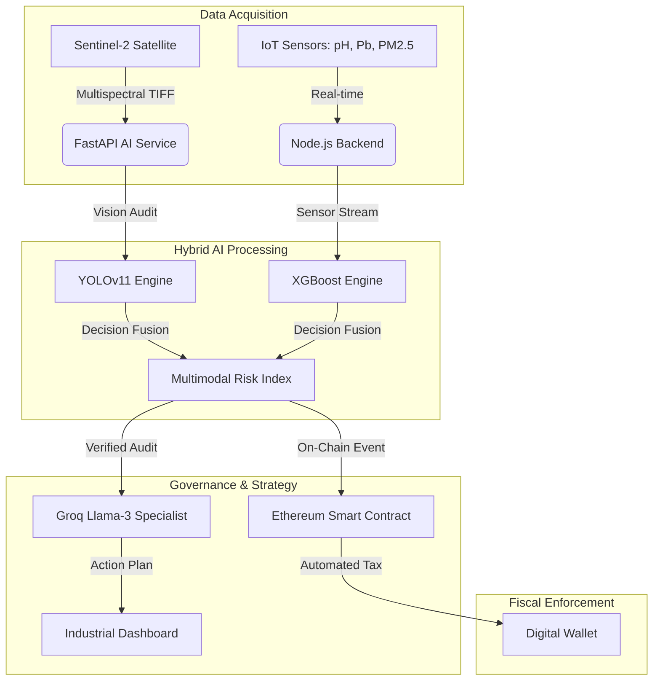

# 🌍 EcoTextil Monastir: Système Hybride d'Audit Environnemental

**Projet Hackathon IA & Environnement** - *Surveillance multi-domaine (Eau, Air, Sol) pour le corridor textile Monastir-Mahdia.*

EcoTextil est une plateforme intégrée conçue pour résoudre la crise environnementale liée à l'industrie textile en Tunisie. Ce projet combine une **IA Hybride (XGBoost + YOLOv11)** pour l'évaluation des risques et un LLM souverain (**Groq**) pour la génération de plans d'action basés sur la norme tunisienne NT 106.02.

## 🚀 Fonctionnalités Clés

- **🧪 Audit Multi-Domaine** : Analyse de données tabulaires sur la qualité de l'eau, de l'air (PM2.5, NO2) et du sol (Plomb, Cadmium) via **XGBoost**.
- **👁️ Vision Multispectrale** : Analyse d'images satellites (Sentinel-3) avec **YOLOv11** pour la détection de panaches de pollution et le déversement de colorants.
- **🧠 Expert Réglementaire (Groq)** : Génération de recommandations et de plans d'actions ancrés dans les directives de l'ANPE et de l'ONAS.
- **📊 Design "Clean-Eco"** : Interface de contrôle épurée avec vue 3D intégrée.

## 🏗️ Architecture Globale du Système

Le système **SAEG Monastir** utilise une architecture en couches pour garantir la performance de l'IA et l'immuabilité de la Blockchain.



## ⚙️ Pipeline Technique & Fusion Multimodale

### 1. Détection de Risque (XGBoost)
L'architecture **XGBoost** (Gradient Boosted Trees) est utilisée pour traiter les données tabulaires massives provenant des capteurs. 
- **Fonction** : Il analyse les séries temporelles pour prédire les dépassements de seuils critiques avant qu'ils ne surviennent. 
- **Précision** : Contrairement aux alertes classiques, XGBoost gère les corrélations non-linéaires entre plusieurs polluants (ex: l'effet combiné du pH et du Plomb sur la toxicité de l'eau).

### 2. Validation Visuelle (YOLOv11)
L'architecture **YOLOv11** (Real-Time Object Detection) effectue un "Audit de Surface" via l'imagerie Sentinel-2.
- **Fonction** : Détection des panaches de pollution thermique ou colorée et identification des vaisseaux suspects.
- **Fusion** : Si XGBoost détecte une anomalie chimique et que YOLO confirme une tache sombre sur le littoral, l'indice de risque passe immédiatement à **NOIR** (Urgence absolue).

### 3. Synthèse Actionnable (Groq & Blockchain)
Le résultat fusionné est envoyé à **Groq (Llama-3)** qui agit comme un consultant ANPE virtuel pour rédiger le plan d'action. Simultanément, la transaction est scellée sur la **Blockchain**, déclenchant la fiscalité environnementale.

## 📐 Algorithme de Transparence & Fiscalité Blockchain

Le système **SAEG Monastir** repose sur une preuve mathématique et immuable pour l'audit environnemental.

### ⚡ Calcul de l'Indice de Performance Toxique (IPT)
L'IPT est calculé dynamiquement par le moteur backend selon la formule normalisée suivante :

$$IPT = (CO_2 \times 0.25) + (Vol. Eau \times Indice Toxicité \times 0.50) + (Déchets \times 0.25)$$

**Classifications :**
- 🟢 **VERT (< 50)** : Conforme aux normes environnementales.
- 🟠 **ORANGE (50 - 100)** : Avertissement technique, inspection recommandée.
- 🔴 **ROUGE (100 - 150)** : Risque élevé, déclenchement du protocole de remédiation.
- ⚫ **NOIR (> 150)** : Violation critique, pénalités maximales.

### ⛓️ Pourquoi la Blockchain ?
L'intégration de la blockchain (Ethereum/Ganache) n'est pas seulement technologique, elle est **légale et fiscale** :
1. **Immuabilité** : Une fois l'audit IoT/Satellite validé, le score IPT est inscrit sur le Smart Contract. Il devient impossible pour une entreprise de falsifier ses registres de pollution après coup.
2. **Automatisation (Smart Tax)** : Le contrat intelligent calcule automatiquement la taxe écologique sans intervention humaine biaisée.
3. **Transparence** : Les autorités et les citoyens peuvent vérifier en temps réel si les usines respectent leurs quotas.

### 💰 Frais de Paiement (Pollueur-Payeur)
Conformément au principe du pollueur-payeur, chaque infraction génère une taxe immédiate :
- **Frais** : `Score IPT × 0.05 ETH`
- **Exécution** : Le paiement est traité via des transactions Web3, assurant que les fonds de compensation environnementale sont collectés sans délai administratif.

## 📦 Installation et Lancement

### 1. Prérequis
- Docker & Docker Compose
- Node.js & npm (pour le developpement Frontend)

### 2. Démarrer l'infrastructure
L'intégralité du système (Base de données, Frontend, et le conteneur IA) se lance via Docker Compose :
```powershell
docker-compose up -d --build
```

### 3. Entraînement Initial de l'IA (Auto-ML)
La plateforme intègre une fonctionnalité d'entraînement dynamique. Pour que l'IA XGBoost apprenne les spécificités du sol, de l'air et de l'eau de Monastir, exécutez la commande suivante (ou utilisez le bouton "Train" du Dashboard) :
```powershell
Invoke-RestMethod -Uri http://localhost:8000/train-xgboost -Method Post
```
*Cette action demandera au **ai-service** de lire les données unifiées, de générer le modèle `xgboost_ecotextil.json` et de le charger en direct.*

## 🧪 Tester l'IA Hybride

Pour évaluer un risque environnemental en envoyant des mesures de capteurs :
```powershell
Invoke-RestMethod -Uri http://localhost:8000/predict-hybrid -Method Post -ContentType "application/json" -Body '{"tabular_data": {"pH": 9.5, "Lead_Pb": 120, "PM2.5": 85}, "image_b64": ""}'
```

---
*Développé pour protéger le corridor textile de Monastir-Mahdia.*